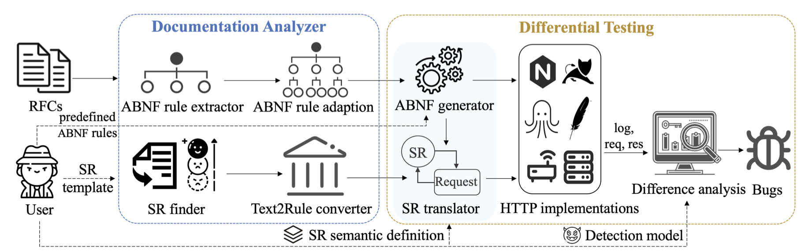

# HDiff

[Overview](#overview) | [Installation](#installation)  | [Results](#results)| [Developers](#developers) | [License](#license)

## Overview

We propose HDiff, a novel semi-automatic detecting framework, systematically exploring semantic gap attacks in HTTP implementations. We designed a documentation analyzer that employs natural language processing techniques to extract rules from specifications, and utilized differential testing to discover semantic gap attacks. We implemented and evaluated it to find three kinds of semantic gap attacks in 10 popular HTTP implementations.  In total, HDiff found 14 vulnerabilities and 29 affected server pairs covering all three types of attacks. In particular, HDiff also discovered three new types of attack vectors. We have already duly reported all identified vulnerabilities to the involved HTTP software vendors and obtained 7 new CVEs from well-known HTTP software, including Apache, Tomcat, Weblogic, and Microsoft IIS Server.




This tools is used to find semantic gap attacks in HTTP implementations. It use a documentation analyzer that employs natural language processing techniques to extract rules from specifications, and utilized differential testing to discover semantic gap attacks.

This tool requires four manual tasks for initialization. What need to be provided:
1. A series of SR template sets for Text2Rule converter
2. SR semanic definition for SR translator
3. Detection models for difference analysis
4. Some predefined ABNF rules to optimize the ABNF generator

For more information, please refer to the [DSN 2022](https://dsn2022.github.io/cpaccepted.html).


## Installation
- Make sure have python3 installed in your computer.
- Download this tool

```
git clone https://github.com/mo-xiaoxi/HDiff.git
```

- Install dependencies

```
sudo pip install -r requirements.txt
```

## Results
All vulnerabilities we found have been reported to related HTTP software vendors. 7 new CVEs listed below have been assigned to the immediately exploitable ones among the vulnerabilities discovered. 

| Name | CVE-ID |
| -------- | -------- |
| Apache Tomcat     | CVE-2019-17569/CVE-2020-1935|
|Apache Traffic Server|	CVE-2020-1944|
|Ktor	|CVE-2020-26129/CVE-2021-25762|
|Hyper	|CVE-2021-21299|
|Microsoft IIS Server|	CVE-2020-0645|
|Oracle Weblogic Server	|CVE-2020-2867/CVE-2020-14588/CVE-2020-14589|
|Puma	|CVE-2020-11076/CVE-2020-11077|
|Red Hat undertow	|CVE-2020-10719|


## Developers

* Shen Kaiwen - [email](mailto:skw17@mails.tsinghua.edu.cn)
* ZeddYu - [email](mailto:zeddyu.lu@gmail.com)
* Yang Yaru - [email](mailto:yangyr17@gmail.com)

## License

HDiff is a free software and licensed under the [GNU license](/LICENSE).


