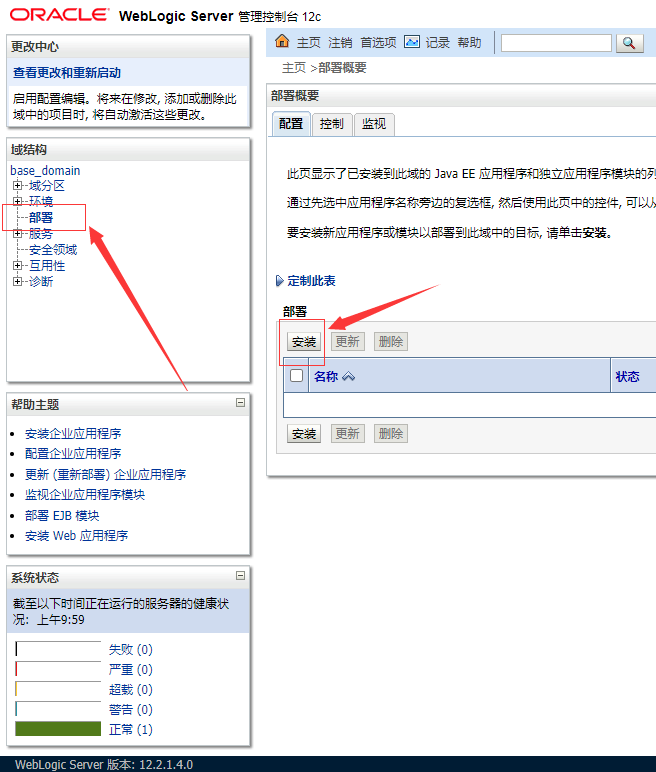

#	Weblogic 环境安装

##	安装步骤

###	主机上的操作：


```
docker build -t weblogic .
docker create --name=weblogic -p 20022:22 -p 7001:7001 weblogic
docker start weblogic
```

下载

http://47.100.54.220/jdk-8u311-linux-x64.tar.gz

http://47.100.54.220/fmw_12.2.1.4.0_wls_quick.jar

把 jdk/weblogic 安装包复制到容器里面

```
docker cp ./jdk-8u311-linux-x64.tar.gz weblogic:/home/ubuntu/jdk/
docker cp ./fmw_12.2.1.4.0_wls_quick.jar weblogic:/home/ubuntu/weblogic/
```


###	容器内操作

使用`ssh -p 20022 ubuntu@127.0.0.1`登录容器，密码为`toor`

并去 jdk 目录解压: `cd jdk && tar -zxvf jdk-8u311-linux-x64.tar.gz` 

添加 JAVA 环境变量至 `~/.profile` 文件末尾

```
export JAVA_HOME=/home/ubuntu/jdk/jdk1.8.0_311
export JRE_HOME=$JAVA_HOME/jre
export PATH=$PATH:$JAVA_HOME/bin:$JRE_HOME/bin
```

加载 JAVA 环境：`source .profile`

安装 weblogic: `cd ~/weblogic && java -jar fmw_12.2.1.4.0_wls_quick.jar`

等待 Weblogic 安装完成...

创建域:
`~/weblogic/wls12214/oracle_common/common/bin/wlst.sh ~/base_domain/createDomain.py`

启动 Weblogic ： `cd ~/base_domain && nohup ./startWebLogic.sh &`

访问 localhost:7001/console 进入管理员界面，登录信息为 `weblogic/moxiaoxi.666`

点击左边的部署，右边选择安装按钮后



选择 ROOT.war ，后面一直下一步安装即可。

访问 localhost:7001 验证是否完成


##	备忘录

```
wls:/offline> readTemplate('/home/zeddy/weblogic/wls12214/wlserver/common/templates/wls/wls.jar')
WARNING: The readTemplate is deprecated. Use selectTemplate followed by loadTemplates in place of readTemplate.
wls:/offline/base_domain>cd('Servers/AdminServer')
wls:/offline/base_domain/Server/AdminServer>set('ListenAddress','')
wls:/offline/base_domain/Server/AdminServer>set('ListenPort', 7001)
wls:/offline/base_domain/Server/AdminServer>cd('../..')
wls:/offline/base_domain>cd('Security/base_domain/User/weblogic')
wls:/offline/base_domain/Security/base_domain/User/weblogic>cmo.setPassword('moxiaoxi.666')
wls:/offline/base_domain/Security/base_domain/User/weblogic>setOption('OverwriteDomain', 'true')
wls:/offline/base_domain/Security/base_domain/User/weblogic>writeDomain('/home/zeddy/base_domain')
wls:/offline/base_domain/Security/base_domain/User/weblogic>closeTemplate()
wls:/offline>exit()
```


使用 ROOT.war 包进行部署，注意要用 JAVA 8 生成 war 包

最终访问 http://localhost:7001/ 检查是否正常运作

访问 http://202.112.51.130:7001?id=1